# Tomcat-Maven-Java-Application-Deployment

**Author:** Alejandra Fernández López

This project demonstrates the development, configuration, and automated deployment of a Java web application onto an Apache Tomcat 9 server running on a virtualized Debian environment. The workflow integrates Maven for build automation and Vagrant for Infrastructure as Code.

---

# Requirements

To run this project locally, you will need the following software installed:

* **Vagrant:** (v2.2+) To manage the virtual machine lifecycle.
* **VirtualBox:** As the provider/hypervisor for the Debian guest OS.
* **Java JDK:** (Compatible with Java 7/8 for Tomcat 9 environments).
* **Apache Maven:** For dependency management and automated deployment.
* **Git:** For version control and repository management.

---

# Project Structure

```
project/
├── config/
│   ├── assets/          
│   ├── tomcat-users.xml  
│   ├── context.xml       
│   ├── tomcat1.war       
│   └── bootstrap.sh      
├── Vagrantfile           
├── .gitignore            
├── LICENSE              
└── README.md
```
---

# Server Configuration Summary
The deployment process is automated through the following configurations:

Infrastructure as Code: A Vagrantfile defines a Debian machine with a private network assigned to 192.168.2.10.

Automated Provisioning: The bootstrap.sh script automates the installation of Java and Tomcat, and places the configuration files in their respective directories.

Server Customization:

* tomcat-users.xml: Configured to allow manager-gui and manager-script access.

* context.xml: Adjusted to permit remote access to the Manager App.

Deployment: The tomcat1.war is deployed to the Tomcat webapps directory during the provisioning phase or manually via Maven.

# 1. Apache Tomcat 9 Installation

This project uses **Apache Tomcat 9** on **Debian 11 Bullseye**.

## 1.1 Java SDK Installation
First, install the OpenJDK development kit:
```bash
sudo apt install -y openjdk-11-jdk
```

## 1.2 Tomcat 9 Installation
Install the application server package:
```
sudo apt install -y tomcat9
```

## 1.3 Security & User Configuration
To ensure the service runs securely, we create a specific group and a dedicated system user:
* Create group:
```
sudo groupadd tomcat9
```

* Create Service User:
```
sudo useradd -s /bin/false -g tomcat9 -d /etc/tomcat9 tomcat9
```

## 1.4 Service Management

**Start and Verify**

Enable and start the Tomcat service:
```
sudo systemctl start tomcat9
sudo systemctl status tomcat9
```

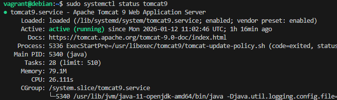

Accessing the Service: http://localhost:8080/

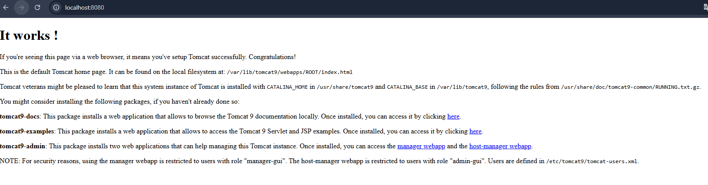

## 1.5 Remote Access Configuration

By default, Tomcat restricts access to administration panels (Host Manager) to ```localhost```. To allow remote access via your host machine, ```the context.xml``` file located in the administration directory must be modified.

Target Path: ```/usr/share/tomcat9-admin/host-manager/META-INF/context.xml```

```
<?xml version="1.0" encoding="UTF-8"?>
<Context antiResourceLocking="false" privileged="true" >
  <CookieProcessor className="org.apache.tomcat.util.http.Rfc6265CookieProcessor"
                   sameSiteCookies="strict" />
  <Valve className="org.apache.catalina.valves.RemoteAddrValve"
         allow="\d+\.\d+\.\d+\.\d+" />
  <Manager sessionAttributeValueClassNameFilter="java\.lang\.(?:Boolean|Integer|Long|Number|String)|org\.apache\.catalina\.filters\.CsrfPreventionFilter\$LruCache(?:\$1)?|java\.util\.(?:Linked)?HashMap"/>
</Context>
```

Restart the server to apply changes:
```
sudo systemctl restart tomcat9
```
---

# 2. Administration Setup

## 2.1 Users and Permissions

To manage the server and deploy applications through the web interface, we must define authorized users. This is done by editing the Tomcat configuration file:
```
sudo nano /etc/tomcat9/tomcat-users.xml
```

The following configuration creates a user named "alumno" with full administrative privileges. This setup is ideal for development and testing environments, providing access to both the graphical interface (GUI) and management scripts.

Configuration File: /etc/tomcat9/tomcat-users.xml
```
<?xml version="1.0" encoding="UTF-8"?>
<tomcat-users xmlns="http://tomcat.apache.org/xml"
              xmlns:xsi="http://www.w3.org/2001/XMLSchema-instance"
              xsi:schemaLocation="http://tomcat.apache.org/xml tomcat-users.xsd"
              version="1.0">
    <role rolename="admin"/>
    <role rolename="admin-gui"/>
    <role rolename="manager"/>
    <role rolename="manager-gui"/>
    <user username="alumno"
          password="1234"
          roles="admin,admin-gui,manager,manager-gui"/>
</tomcat-users>
```

## 2.2 Web Manager Installation

To manage applications and virtual hosts through the browser interface, we need to install the Tomcat administration packages. Execute the following command:

```
sudo apt install -y tomcat9-admin
```

## 2.3 Accessing the Administration Panels

**URL:** [http://localhost:8080/manager/html](http://localhost:8080/manager/html)

* **Login:** When prompted, enter the credentials defined in your `/etc/tomcat9/tomcat-users.xml` file.
* **User:** `alumno`
* **Password:** `1234`

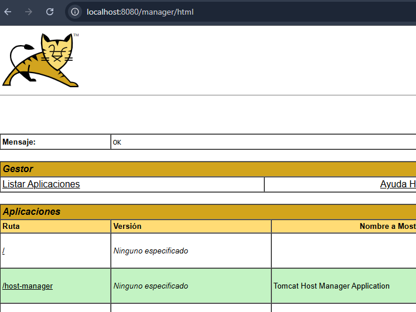

To verify and manage virtual hosts, navigate to:
**URL:** [http://localhost:8080/host-manager/html](http://localhost:8080/host-manager/html)

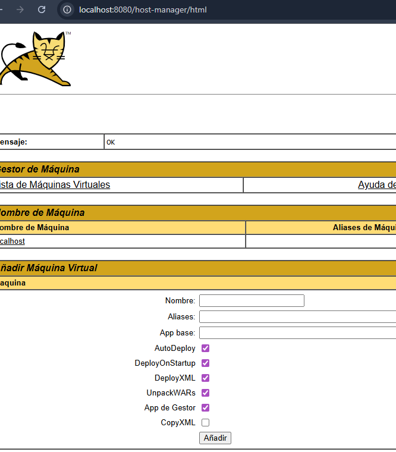

---
# 3. Manual Deployment via GUI

In this section, we will manually deploy a pre-packaged web application using the Tomcat Web Manager interface.

## 3.1 Deployment Steps

1. **Login:** Access the Manager App at `http://192.168.2.10:8080/manager/html` using your administrative credentials (`alumno` / `1234`).
2. **Locate the WAR File:** Ensure you have the `tomcat1.war` file available (found in the `config/` directory of this repository).
3. **Upload the Package:** * Scroll down to the section titled **"WAR file to deploy"**.
   * Click on **Choose File / Browse** and select `tomcat1.war`.
   
4. **Deploy:** Click the **Deploy** button.
5. **Verify:** Once uploaded, the application will appear in the applications list under the path `/tomcat1`.
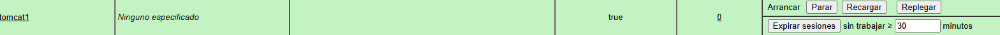

---

# 4. Automated Deployment with Maven

## 4.1 Installing Maven

To install Maven on your Debian 11 system, execute the following commands:

```
sudo apt-get update && sudo apt-get -y install maven
```

## 4.2 Enhanced Tomcat User Configuration
We need to add a specific role, `manager-script`, which allows Maven to interact with Tomcat via its API. Update your `/etc/tomcat9/tomcat-users.xml` with the following:

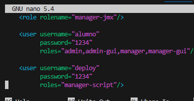

## 4.3 Maven Settings Configuration
Next, we must tell Maven which credentials to use when it tries to connect to the server. Edit the global Maven settings file:

```
sudo nano /etc/maven/settings.xml
```
Locate the <servers> block and add a new server entry with an id (this ID will be used later in your pom.xml):

Excerpt from: `/etc/maven/settings.xml`

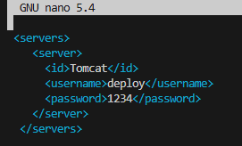

### 4.4 Generating the Java Web Project

With Maven installed and configured, we can now generate a sample web application using an archetype (a project template).

### 4.4.1 Create the Project

Navigate to your home directory and execute the following command to generate the project structure:

```
$ mvn archetype:generate -DgroupId=org.zaidinvergeles \
                         -DartifactId=tomcat-war \
                         -Ddeployment \
                         -DarchetypeArtifactId=maven-archetype-webapp \
                         -DinteractiveMode=fa
```

### 4.4.2 Verification
After the process completes, you should see the following confirmation in your terminal:

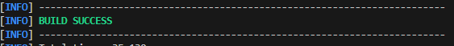

### 4.4.3 Enter the Project Directory

A new directory named tomcat-war-deployment has been created. Move into it to start working:

```
cd tomcat-war-deployment
```

## 4.5 Configuring the POM File

To enable automated deployment, we must modify the Project Object Model (`pom.xml`) file. This tells Maven to use the Tomcat plugin and specifies the target server details.

**Insert the following block into your `<build></build>` tags:**

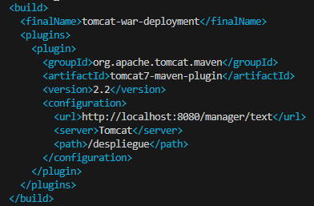

## 4.6 Application Deployment

To upload and start your application on the server for the first time, run:
```
mvn tomcat7:deploy
```

If you make changes to your code and want to update the version already running on the server, use the redeploy command:
```
mvn tomcat7:redeploy
```

To undeploy (remove) the application from the Tomcat server, run:
```
mvn tomcat7:undeploy
```

### 4.6.1 Verification
After executing the deployment command, Maven will confirm that the process was completed successfully:

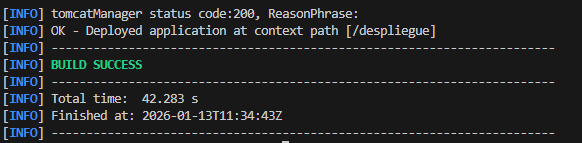

To test the application directly, navigate in your browser:

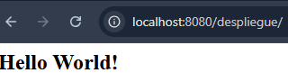

---

# 5. Deploying "Rock-Paper-Scissors" Game

We will now deploy a third-party Java web application. Follow these steps:
```
git clone https://github.com/cameronmcnz/rock-paper-scissors.git
```
```
cd rock-paper-scissors
```

Move to the development branch containing the web project:
```
git checkout patch-1
```

## 5.1 Update the POM File

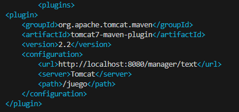

## 5.2 Execute Deployment
Run the Maven command to upload the game to your server:

```
mvn tomcat7:deploy
```

## 5.3 Final result

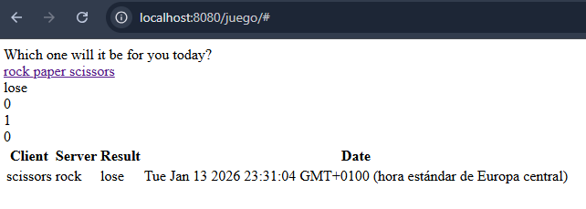
